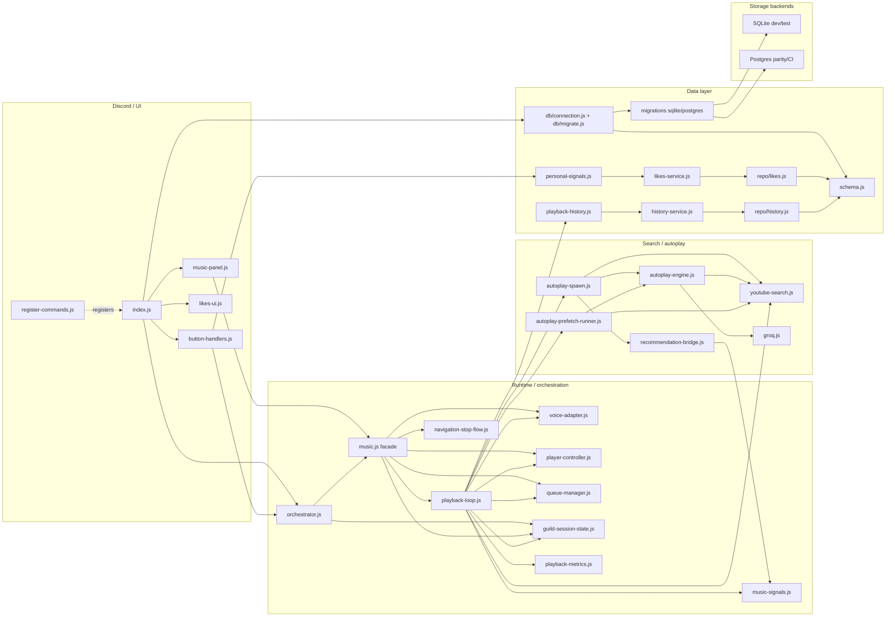
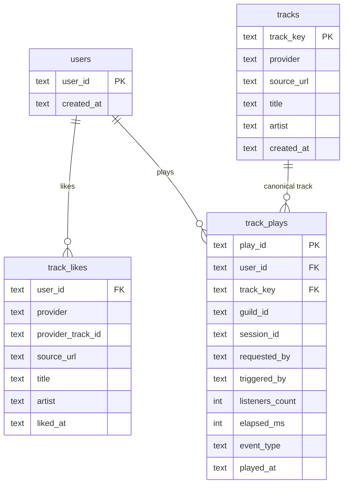

# Архитектура бота PAWPAW

**Обновлено:** 2026-04-19  
**Среда:** Node.js ≥ 18.17, ES-модули (`"type": "module"`)  
**Точка входа:** `npm start` → `src/index.js`

Текущее состояние, обкатка и отложенные шаги вынесены в [СТАТУС.md](СТАТУС.md).

---

## Содержание

1. [Назначение](#назначение)
2. [Как читать файл](#как-читать-файл)
3. [Технологический стек](#технологический-стек)
4. [Контур runtime](#контур-runtime)
5. [Потоки и состояние](#потоки-и-состояние)
6. [Интеграции и persistence](#интеграции-и-persistence)
7. [Эволюция](#эволюция)

---

## Назначение

Бот **PAWPAW** для Discord:
- Воспроизведение музыки с YouTube в голосовых каналах
- Управление очередью, повтором, паузой через кнопки в чате
- Автоплей: подбор следующего трека через Groq API + эвристики + сигналы
- Двухфазный prefetch: фоновая подготовка кандидатов ещё до конца текущего трека
- Чат (Groq), генерация изображений (Pollinations)
- Лайки треков (сохраняются в БД)
- Заготовка под HTTP API и WebSocket для веб/мобильного клиента

---

## Как читать файл

- Этот файл отвечает на вопрос **как устроена система**: модули, потоки, границы владения состоянием и точки интеграции.
- Текущее состояние проекта, обкатка и сознательно отложенные шаги живут в [СТАТУС.md](СТАТУС.md).
- Инварианты и запреты для runtime вынесены в `docs/ИНВАРИАНТЫ.md`.
- Data layer policy и backend discipline описаны в `docs/adr/001-data-layer.md`.
- Переменные окружения и операторские значения собраны в `docs/ПЕРЕМЕННЫЕ.md`.

---

## Технологический стек

| Технология | Версия / пакет | Назначение |
|---|---|---|
| Node.js | ≥ 18.17 | Среда выполнения |
| Discord API | `discord.js` v14 | Клиент, интеракции, кнопки |
| Голос | `@discordjs/voice` | Голосовое соединение, AudioPlayer |
| Аудио-стрим | `yt-dlp` (`youtube-dl-exec`) | Скачивание аудио с YouTube |
| Аудио-обработка | `ffmpeg-static` | FFmpeg для нормализации громкости |
| Метаданные/поиск | `play-dl` | Поиск YouTube, `video_basic_info` |
| ИИ | Groq HTTP API | Подбор следующего трека, чат |
| Изображения | `image.pollinations.ai` | Генерация по промпту |
| Криптография | `libsodium-wrappers` | Обязательно для голоса в discord.js |
| БД | PostgreSQL (`pg`) + SQLite (`better-sqlite3`) | Лайки, playback history foundation, миграции |
| Конфигурация | `dotenv` | Переменные окружения |

---

## Проверка кода

Перед релизом или после крупных правок запускать из каталога `bot/`:

```bash
npm run verify
```

Скрипт `scripts/verify-modules.mjs` делает три вещи:
1. `node --check` для каждого `src/*.js` — синтаксис
2. Динамический `import` каждого модуля (кроме `index.js` и `register-commands.js`)
3. Смоук-тесты без сети: нормализация URL, дедуп очереди, форматирование, флаги autoplay, переходы FSM навигации

`index.js` и `register-commands.js` не импортируются в verify: первый сразу делает `client.login()`, второй — `REST.put()` в Discord API.

---

## Контур runtime

Ниже перечислены стабильные runtime-подсистемы и их границы ответственности.

### Подсистемы и модули

#### Ядро плеера

| Модуль | Строк | Что делает |
|---|---|---|
| `music.js` | ~670 | **Facade после Шага 10.** Содержит только target'ы для `orchestrator.commands.*` (`enqueue`, `skip`, `previousTrack`, `pause/resume`, `toggleRepeat/Autoplay`, `stopAndLeave`), domain state queries (`isGuildPlayingMusic`, `getMusicTransportState`, `getRepeatableTrackLabel`, `getCurrentPlaybackInfo`), регистрацию пользовательского запроса для автоплея (`registerAutoplayUserQuery`) и реэкспорт callback-setters из `playback-loop.js`. **Никаких Map гильдий, процессов или циклов воспроизведения.** Голоса касается через `voice-adapter.js`, плеера — через `player-controller.js`, playback core — через публичный API `playback-loop.js` (`ensureGuildMusicState`, `getGuildMusicState`, `killYtdlp`, `schedulePlayNext`). После Шага 7 внешние клиенты (Discord-слой) общаются с `music.js` **только через `orchestrator.commands.*`**. |
| `playback-loop.js` | ~640 | **Ядро воспроизведения, вынесено из `music.js` в Шаге 10.** Единственный владелец `guildState: Map<guildId, GuildMusicState>` (per-guild proc tracker: `ytdlp`, `ffmpegNormalize`, `streamHandle`, `lastEndReason`). Содержит: реакцию на события `AudioPlayer` (`handlePlayerIdle` через pure `resolveIdleVerdict`, `handlePlayerError`, `handlePlayerStateChange` — регистрируются в `player-controller` при импорте); цикл `runPlayNext` с сериализацией через `schedulePlayNext`; streaming-шаг `streamUrl` (audio-pipeline → `StreamHandle` → metrics + history); фабрику autoplay spawner'а (через `createAutoplaySpawner`); callback'и UI, потребляемые только loop'ом (`onPlaybackUiRefresh`, `onPlayingTrackDisplay`, `onPlaybackIdle`, `onAutoplaySpawned`). Публичный контракт: `ensureGuildMusicState(id)`, `getGuildMusicState(id)` (read-only, `undefined` для unknown), `killYtdlp(s)` (idempotent), `schedulePlayNext(id, reason)`, + 4 setter'а колбэков. Legacy-флаг `ytdlpStreamError` удалён в 6c-b, источник `streamFailed` — `StreamHandle` (`s.lastEndReason` + `pendingFatal`). |
| `orchestrator.js` | ~280 | Единая точка входа для всех клиентов (Discord, будущий HTTP/WebSocket API). **`commands.*`** (8 методов): `enqueue`, `skip`, `previousTrack`, `pause`, `resume`, `toggleRepeat`, `toggleAutoplay`, `stopAndLeave` — тонкие прокси над `music.js` с единым `Result<T>` возвратом (`{ok:true, value?}` / `{ok:false, reason, code}`). Коды ошибок: `invalid_argument`, `not_playing`, `no_history`, `not_applicable`, `enqueue_error`. Результаты заморожены (`Object.freeze`). **`events.*`** (внутренний реактивный API): `onVoiceReady(guildId, channelId)` → `startSession` + `setBotVoiceState(connected)`, `onVoiceGone(guildId, reason)` → `endSession` + `setBotVoiceState(disconnected)`. Вызывается из `voice-adapter` через `registerVoiceAdapterCallbacks`. Policy-логика не размазывается в orchestrator — живёт в доменных модулях. Debug-лог под `ORCHESTRATOR_DEBUG=1`. |
| `voice-adapter.js` | ~395 | Единственный владелец `VoiceConnection` и auto-leave таймеров. `ensureVoiceConnection(channel, player)` (атомарно), `leave(guildId, reason?)`, `isConnectionAlive(id)`, `awaitReady(id, ms)`, `getConnection(id)`, `getConnectedChannelId(id)`, `attachVoiceAutoLeave(client)`, `checkVoiceChannelEmptyNow(guild)`, `clearAutoLeaveTimer(id)`, `registerVoiceAdapterCallbacks({onVoiceReady,onVoiceGone,onAutoLeaveTimeout})`. stateChange listener автоматически помечает сессию ушедшей на Disconnected/Destroyed. Наружу объект соединения напрямую никто кроме адаптера не получает. |
| `player-controller.js` | ~240 | Единственный владелец `AudioPlayer` и флага `playing` на гильдию. `ensurePlayer(id)` (idempotent, создаёт + подписывает listener'ы), `getPlayer(id)` (только для `voice-adapter.subscribe`), `playResource(id, resource)`, `pause(id)` / `resume(id)` / `stopPlayer(id)` / `destroyPlayer(id)`, `isPlaying(id)` / `getStatus(id)` / `hasPlayer(id)` / `markNotPlaying(id)`, `registerPlayerControllerCallbacks({onIdle,onPlayerError,onPlayerStateChange})`. Listener'ы Idle/error/stateChange фаерят зарегистрированные колбэки; `music.js` регистрирует их при импорте. Объект плеера получает только `voice-adapter` через `conn.subscribe(player)`. |
| `player-idle-verdict.js` | ~60 | Pure-арбитр для реакции на `AudioPlayerStatus.Idle`. `resolveIdleVerdict({wasPlaying,streamFailed,suppressFinished,repeatOn})` → плоский `{ignore,emitTrackFinished,forceSkipFromQueue,scheduleNext}`. Одинаковый input → одинаковый verdict, state не читает/пишет. `playback-loop.js::handlePlayerIdle` делает snapshot входов (включая consuming `consumeSuppressTrackFinishedOnce`) ДО вызова арбитра и после получения verdict выполняет тривиальный диспатч побочек. Разграничение с pre-stop шагом фиксируется явно: при `suppressFinished=true, repeatOn=true` `forceSkipFromQueue=false` — shift уже сделан в `executeSkipPreStopMachine` до `stopPlayer`. |
| `queue-manager.js` | ~200 | Единственный владелец очереди воспроизведения. `enqueueTrack`, `enqueueTrackIfNotQueued`, `unshiftTrack`, `unshiftTrackIfNewHead`, `peekNext`, `dequeueNext`, `shiftIfHead(ref)`, `removeItem(ref)`, `clearQueue`, `getQueueLength`, `getQueueSnapshot`, `getQueueOps(guildId) → QueueOps` (заморожённый binding для библиотечных apply-шагов). Массив очереди наружу не утекает. |
| `playback-schedule.js` | ~35 | `createSchedulePlayNext(runPlayNext)` → сериализованная очередь вызовов `runPlayNext` по гильдии. Один pending job на гильдию. |
| `queue-invariants.js` | ~80 | `QueueItem` (`url`, `source`, `title?`, `requestedBy?`, `requestedByName?`), `extractYoutubeVideoId`, `sameTrackContent` / `sameYoutubeContent`, `pushQueueIfNotQueued`, `unshiftQueueIfNewHead`. Low-level pure-утилиты; production-код ходит через `queue-manager`. |
| `guild-session-state.js` | ~215 | Централизованный in-memory стейт на гильдию: `PlayerState`, `StatusReason`, `setPlayerState`, `resolvePlayerUIState`, `sessionId`, `prefetchGeneration`, `listenersCount`, `botVoiceState`, снимок `getGuildSessionSnapshot`. Не знает про Discord. |
| `stop-and-leave-steps.js` | ~60 | Шаги `stopAndLeave`: убить yt-dlp, ffmpeg, покинуть канал, очистить стейт. |
| `navigation-stop-flow.js` | ~80 | Общий stop flow при skip/stop/disconnect. |

#### Автоплей

| Модуль | Строк | Что делает |
|---|---|---|
| `autoplay-spawn.js` | ~650 | Полный spawn pipeline автоплея, вынесен из `music.js` в Шаге 8. В Шаге 9 в него inline'ены **private pipeline helpers** (ранее `autoplay-spawn-search.js` + `autoplay-spawn-apply.js`) — линейное чтение всего pipeline в одном файле. Экспорт: `createAutoplaySpawner({notifyPlaybackUiRefresh,getOnAutoplaySpawned})` → `{ spawnAutoplayPlaylist }`, `isYoutubeUrlBlockedForAutoplaySpawns` (recent-URL guard, используется также в `runPlayNext`/prefetch), `createAutoplaySpawnStaleGuard`. Внутри — prefetch pool fast-path → `syncAndGetHints` → `pickAutoplayRetrieval` → **sequential early-exit search** (`runAutoplaySearchStep` private) → **rank/filter/apply** (`applyAutoplayCandidatesStep` private) → stale/connection guards на всех фазах (`after_retrieval`/`after_search`/`before_enqueue`) → запись surplus в prefetch pool. Outcome `'queued' \| 'skip' \| 'fail'`. Фабрика, а не прямая функция: `spawn` дёргает два music-local callback'а (UI-refresh + registered `onAutoplaySpawned`), deps-поверхность заморожена в 2 полях. |
| `autoplay-engine.js` | ~310 | `pickAutoplayRetrieval` — главный entry point подбора: fast lane → Groq artist-pack → struct → fallback → `applyAutoplayQueryPolicy`. Основное разнообразие должно рождаться здесь и в candidate shortlist; escape-ветка ниже — аварийный redirection, а не главный механизм diversity. |
| `autoplay-spawn-context.js` | ~50 | `buildAutoplaySpawnContext` — собирает контекст для Groq (seed, pivot, played titles, used queries). Shared между `autoplay-spawn.js` и `autoplay-prefetch-runner.js`. |
| `autoplay-session-state.js` | ~145 | `getAutoplaySessionSnapshot`, `beginAutoplayResolving`/`endAutoplayResolving`/`isAutoplayResolving`, `setAutoplay{InitialSeed,LastIntent,TopicIntent,IdentityIntent}`, `pushAutoplayUsedQuery`, `appendAutoplaySessionTitle`, `clearAutoplaySessionState`. Содержит также чистые **seed builders** (`buildAutoplaySeedForGroq`, `buildAutoplayPivotSeed`) — читают только данные этого модуля. |
| `autoplay-stale-guard.js` | ~100 | `bumpAutoplaySpawnGeneration`, `checkAutoplaySpawnStaleDiscard` — отбрасывание запоздавших результатов async spawn. Wrapper-фабрика `createAutoplaySpawnStaleGuard` живёт в `autoplay-spawn.js`. |
| `autoplay-policy.js` | ~240 | Политика запросов: анти-луп, quarantine, token-family. |
| `autoplay-recovery.js` | ~90 | Streak плохих spawn → ограничение Groq вызовов. |
| `autoplay-variety.js` | ~110 | Штрафы variety в ranker (артист, семья запросов). |
| `autoplay-artist-tokens.js` | ~100 | `extractLeadArtistTokenFromTitle`, `detectDominantArtist`. Для quick-skip quarantine парсер умеет использовать не только title, но и Topic-style `channelName`, если он сохранён в queue item. |
| `autoplay-baseline.js` | ~120 | Baseline-телеметрия: `spawn_end`, `idle_to_play`, `stream_fail`. |
| `autoplay-telemetry.js` | ~45 | `autoplayDebug` — подробные debug-логи (`AUTOPLAY_DEBUG=1`). |
| `retrieval-plan.js` | ~130 | Fast lane без Groq (`AUTOPLAY_FAST_LANE_ENABLED`). |
| `candidate-ranker.js` | ~100 | `rankAutoplayCandidates` — финальный score по searchScore + сигналам + штрафы. |

##### Escape branch contract

`autoplay-escape-state.js` фиксирует отдельную сущность:
**escape as temporary branch, not as destructive rewrite**.

Инварианты модуля:
- feature flag `AUTOPLAY_ESCAPE_ENABLED` по умолчанию выключен; подключение идёт отдельными call-site'ами;
- branch lifecycle живёт отдельно от `autoplay-session-state.js`: session intent остаётся основным и стабильным;
- `trial` не префетчит ничего, `provisional` разрешает только cheap/fast prefetch, `confirmed` возвращается к normal mode;
- depth cap = 2: один root trial и максимум один child trial из provisional;
- cooldown считается в autoplay spawn'ах, не в минутах;
- явное пользовательское действие (`user enqueue`, `stopAndLeave`, `autoplay off`) убивает активную ветку сразу.

FSM автомата:
`none -> trial -> provisional -> confirmed|killed -> none`

Точки внешнего воздействия:
- basin-trigger в `music.js` поднимает новый `trial`, если quick-skip действительно указывает на один basin;
- lifecycle hook на quick-skip двигает `trial` в `killed` или оставляет ветку жить дальше по dwell-порогу `T`;
- lifecycle hook на `track_finished` подтверждает ветку в `confirmed`, после чего retrieval возвращается в normal mode и использует confirmed anchor как secondary positive context.

Operational limitations:
- escape mode практически требует включённого Groq: без него retrieval деградирует в шумный fallback, и trial обычно быстро умирает через `killed`;
- `AUTOPLAY_ESCAPE_COOLDOWN_SPAWNS` отсчитывается не в каждом autoplay spawn, а в quick-skip trigger attempts, где новый basin-trigger реально мог бы стартовать ветку.
- escape не решает базовую монотонность retrieval сам по себе: основная работа по diversity должна происходить в candidate layer, anti-repeat фильтрах и составе shortlist.

Telemetry side-channel:
- `autoplay-escape-telemetry.js` хранит in-memory counters по transition'ам и kill reason'ам;
- `autoplay-spawn.txt` получает компактный `escape` summary (`phase`, `mode`, `branchId`, `confirmedAnchorsCount`, `dFallbackUsed`, `cooldownRemaining`) для каждого spawn.

Короткие эксплуатационные заметки по rollout diversity-слоёв вынесены отдельно в [AUTOPLAY-NOTES.txt](AUTOPLAY-NOTES.txt), чтобы не превращать архитектурный файл в журнал наблюдений.

#### Prefetch

| Модуль | Строк | Что делает |
|---|---|---|
| `autoplay-prefetch.js` | ~250 | Два пула кандидатов на гильдию: `guildId:fast` и `guildId:full`. `storeFast`, `storeFull` (с атомарным bump генерации), `popBestCandidate` (приоритет full → fast), `invalidatePool`, `clearPool`. |
| `autoplay-prefetch-runner.js` | ~340 | `runProactivePrefetch` — fire-and-forget лончер двух фаз. Фаза 1 (fast, +1с): нормализованный тайтл → 1 yt-dlp → `storeFast`. Фаза 2 (full, +15с): Groq → 1 yt-dlp → `storeFull`. |

#### Поиск и YouTube

| Модуль | Строк | Что делает |
|---|---|---|
| `youtube-search.js` | ~1340 | Поиск YouTube, scoring, `pickDistinctTrackVideos` (5 параллельных yt-dlp запросов), `pickTracksForArtist`, `resolveYoutubeFromQuery`, `resolveYoutubeCanonicalTitle`, `normalizeTitleForContext`. Семафор поиска `MAX_CONCURRENT_YTDLP_SEARCH=5`. |
| `track-provider.js` | ~50 | `makeProviderTrackId(provider, videoId)`, `providerTrackIdFromUrl` — canonical identity для multi-source. |
| `playability-cache.js` | ~160 | Кэш неиграбельных URL (in-memory, TTL 7 суток). `recordPlayabilityFailure`, `isUrlMarkedBad`, `clearPlayabilityBadOnSuccessfulPlay`. |

#### UI

| Модуль | Строк | Что делает |
|---|---|---|
| `music-panel.js` | ~530 | Discord-сообщения панели и списка: lifecycle (создать/обновить/удалить), рендеринг состояния. Колбэки из `music.js` обновляют панель. `syncInteractionMusicPanel`, `applyIdleMusicUi`, `addTracksAndUpdateUI`. |
| `button-handlers.js` | ~120 | Обработчики всех кнопок панели. После Шага 7 вызывает доменные use-case'ы через `orchestrator.commands.*` (единая точка входа для Discord-слоя), а не напрямую `music.js`. Обновляет панель через `panel-update-queue`. Единственное место для добавления новых кнопок. |
| `panel-update-queue.js` | ~35 | Сериализует все `msg.edit` на панель по гильдии через Promise-цепочку. Устраняет race condition между нажатием кнопки и фоновым обновлением. LOADING-уведомления обходят очередь (fire-and-forget). |
| `queue-line-format.js` | ~37 | `formatSingleQueueLine`, `formatAutoplayQueueLine` — форматирование строк очереди. |
| `ui-components.js` | ~178 | Константы кнопок `BTN_*`, `MODAL_*`, `FIELD_*`. `buildMusicControlRows`, `buildPlayModal`. |

#### Сигналы и рекомендации

| Модуль | Строк | Что делает |
|---|---|---|
| `music-signals.js` | ~240 | In-memory кольцевой буфер событий (100 на гильдию): `track_started`, `track_finished`, `track_skipped`, `track_previous`, `track_liked`. Запись на диск `data/signals.json`. |
| `recommendation-bridge.js` | ~194 | Local boost кандидатов по сигналам. Опциональный HTTP-сервер рекомендаций (`MUSIC_SIGNALS_ENDPOINT`). |
| `personal-signals.js` | ~124 | Runtime facade для персональных сигналов. Лениво поднимает DB-backed likes service, кеширует process-local connection/service, экспортирует `emitLike` и `listLikes`, при bootstrap/storage-сбое деградирует в `{ ok:false, reason:'db_error' }` или `[]`. |
| `playback-history.js` | ~160 | Runtime facade для playback history. Лениво поднимает DB-backed `history-service`, экспортирует `recordPlaybackHistory`, пишет best-effort/fire-and-forget, а события без честного user attribution (`requestedBy ?? actor`) пропускает без bootstrap БД. |

#### Навигация idle/prev

| Модуль | Строк | Что делает |
|---|---|---|
| `idle-navigation-state-machine.js` | ~120 | FSM переходов истории треков. Чистая логика, без побочных эффектов. |
| `idle-navigation-machine-api.js` | ~80 | API переходов FSM: `applyIdleNavigationTransition`. |
| `idle-navigation-state.js` | ~105 | Хранение состояния курсора: `pastTrackUrls`, `idleNavCursor`, `idleBackForwardTail`. |
| `idle-navigation-apply.js` | ~70 | Применение результата FSM к очереди и стейту. |

#### Инфраструктура

| Модуль | Строк | Что делает |
|---|---|---|
| `index.js` | ~340 | Клиент Discord, роутинг интеракций (slash / кнопки / модалки). Обработчик `voiceStateUpdate` (счётчик слушателей). Slash read-path `/likes` отдаёт эпhemeral-список избранного через `personal-signals.listLikes`. |
| `groq.js` | ~670 | Groq API: `groqNextTrackStruct`, `groqNextTrackQuery`, `chatGroq`, `isGroqConfigured`. Промпты только на английском. |
| `audio-normalize.js` | ~63 | FFmpeg после yt-dlp: нормализация громкости (`dynaudnorm`). |
| `single-instance.js` | ~67 | Lock-файл: один процесс бота. |
| `ytdlp-auto-update.js` | ~37 | Автообновление yt-dlp по расписанию. |
| `playback-metrics.js` | ~140 | Текстовые метрики в `data/metrics/*.txt`. См. `docs/НАБЛЮДАЕМОСТЬ.md`. |

---

### Граф зависимостей



Ключевые границы:
- Discord-слой ходит в домен через `orchestrator.js`, `music-panel.js` и узкие runtime-facade для персональных сигналов.
- Playback write-path истории идёт через `playback-history.js`, а likes read/write-path — через `personal-signals.js`.
- `db/connection.js` и `db/migrate.js` отвечают только за open/guard/migrations; SQL живёт в `repo/*`, а fail-policy — в `*service.js`.
- Один owner схемы — `src/db/schema.js`; generated migration packs разделены по backend: `sqlite/` и `postgres/`.

---

## Потоки и состояние

Этот блок отвечает на вопрос, как команда или событие проходят через runtime и кто владеет изменяемым состоянием.

### Ключевые потоки

#### Добавление трека пользователем

```
/музыка [запрос]
  → index.js handleAddSingleTrack
  → enqueue(voice, query, 'single', userId, displayName)
  → resolveYoutubeFromQuery   ← yt-dlp или play-dl поиск
  → pushQueueIfNotQueued      ← дедуп по videoId
  → schedulePlayNext('enqueue-first')
  → runPlayNext
  → streamUrl                 ← yt-dlp стрим → ffmpeg → AudioPlayer
```

#### Автоплей (очередь опустела)

```
AudioPlayer Idle → schedulePlayNext('player-idle')
  → runPlayNext: очередь пуста, autoplay включён
  → spawnAutoplayPlaylist(guildId, seed)
      1. popBestCandidate()           ← pool_hit: ~5ms ✓
      2. (если пул пуст) Groq retrieval    ← ~700ms
      3. runAutoplaySearchStep()      ← sequential early-exit, 1 запрос
         pickDistinctTrackVideos      ← 5 yt-dlp параллельно, семафор=5
      4. rankAutoplayCandidates       ← score + фильтры
      5. pushQueueIfNotQueued
  → void schedulePlayNext('autoplay-after-spawn')
```

#### Двухфазный prefetch (фоновый)

```
Трек начал играть → void runProactivePrefetch(guildId, title, ctx)
  │
  ├─ Фаза 1 (+1с, fast):  нормализованный тайтл → 1 yt-dlp → storeFast(:fast)
  └─ Фаза 2 (+15с, full): Groq → 1 yt-dlp → storeFull(:full, bump gen)

При следующем skip → popBestCandidate() → pool_hit (~5ms)
Иначе → полный spawn (~5-8с)
```

#### Кнопки панели

```
Нажатие кнопки → index.js handleButtonInteractions
  → deferUpdate()          ← расширяет окно до 15с
  → skip() / pauseMusic() / toggleAutoplay() / ...
  → syncInteractionMusicPanel()   ← обновляет панель через msg.edit
```

---

### Владение состоянием

| Что | Модуль | Как хранится |
|---|---|---|
| Очередь воспроизведения | `queue-manager.js` | Map `guildId → QueueItem[]`, массив наружу не утекает |
| VoiceConnection + auto-leave timer | `voice-adapter.js` | Map `guildId → VoiceConnection`, Map `guildId → Timeout`, объект соединения наружу не утекает |
| AudioPlayer + `playing` флаг | `player-controller.js` | Map `guildId → AudioPlayer`, Map `guildId → boolean`. Объект плеера отдаётся только `voice-adapter` через `getPlayer(id)` для `conn.subscribe`. |
| yt-dlp, ffmpeg, streamHandle, lastEndReason | `playback-loop.js` (`guildState` Map) | `GuildMusicState` объект на гильдию (без очереди, connection, player, playing). `streamHandle` — активный `StreamHandle` текущей попытки воспроизведения; `lastEndReason` — типизированный вердикт от `handle.whenEnded` (единственный источник `streamFailed` после 6c-b). yt-dlp / ffmpeg процессы обнуляются минимальными `on('close')` listener'ами в `streamUrl`. |
| PlayerState, StatusReason | `guild-session-state.js` | Map + WS-событие при изменении |
| sessionId, prefetchGeneration | `guild-session-state.js` | Map, пишет **только `orchestrator.events.onVoiceReady/onVoiceGone`** (реакция на voice-adapter события) |
| listenersCount | `guild-session-state.js` | Map, обновляется из `voiceStateUpdate` |
| botVoiceState | `guild-session-state.js` | Map, пишет `orchestrator.events.onVoiceReady/onVoiceGone` |
| repeat, autoplay | `guild-session-state.js` (Set) | Читает напрямую `music.js` |
| Текущий URL/лейбл/QueueItem | `guild-session-state.js` (Map) | Читает напрямую `music.js` |
| История треков (prev) | `idle-navigation-state.js` | Map (`pastTrackUrls`, cursor) |
| Prefetch пулы | `autoplay-prefetch.js` | Map: `guildId:fast`, `guildId:full` |
| Сигналы событий | `music-signals.js` | Кольцевой буфер + `data/signals.json` |
| UI панель/список | `music-panel.js` | Map по гuildId |
| Автоплей-контекст | `autoplay-session-state.js` | Берёт из `guild-session-state` |

**Правило владения PlayerState:** только `guild-session-state.setPlayerState()`. Никто другой не пишет UI-состояние напрямую.

---

## Интеграции и persistence

Здесь собраны внешние интерфейсы системы: API-слой и persistence layer.

### HTTP API и WebSocket

#### Текущее состояние

Реализовано, но **не подключено** к `index.js` (намеренно — пока в разработке):

| Файл | Что |
|---|---|
| `src/api/server.js` | Fastify сервер, `startApiServer()` |
| `src/api/ws-emitter.js` | WebSocket broadcast, `emitWsEvent`, `subscribeClient` |
| `src/api/routes/session.js` | `GET /guilds/:id/session` — снимок состояния гильдии |
| `src/api/routes/auth.js` | Discord OAuth2 заготовка |
| `src/api/routes/playlists.js` | Заглушка (TODO) |
| `src/db/` | Миграции, `pg` + `sqlite` адаптеры |

**Чтобы включить:** добавить `await startApiServer()` в `index.js`.

#### WebSocket-события (уже реализованы)

`guild-session-state.js` эмитит `player_state_changed` при каждом вызове `setPlayerState`. Клиент подписывается по `guildId`.

#### Точка входа для команд — `orchestrator.commands`

После Шага 7 все use-case команды доступны через единый слой `orchestrator.commands` (см. раздел «Ядро плеера» → `orchestrator.js`). HTTP-роуты должны вызывать те же 8 методов, что и Discord-кнопки — так клиенты остаются взаимозаменяемыми, а форма ответа (`Result<T>` с `code`) прямо ложится на HTTP-коды (`invalid_argument → 400`, `not_playing → 409`, `enqueue_error → 500` и т.д.).

#### Авторизация

`userCanAccessGuild` в `session.js` — **заглушка (всегда true)**. Перед открытием API в продакшн требует реализации проверки членства в Discord-сервере.

---

### База данных

#### Миграции

Пронумерованные SQL-файлы лежат в `src/db/migrations/sqlite/` и `src/db/migrations/postgres/`, ownership схемы — `src/db/schema.js`, а запуск делается через `node src/db/migrate.js`.

Startup barrier в `src/index.js` выглядит так:

`dotenv -> openDatabaseConnection -> runDatabaseMigrations -> close bootstrap connection -> client.login()`

Если миграции не применились, бот не логинится в Discord вообще.

#### Таблицы

| Таблица | Назначение | Статус |
|---|---|---|
| `users` | Пользователи | Пишется при лайке и записи history |
| `track_likes` | Лайкнутые треки | Пишется через `personal-signals.js` → `likes-service` |
| `tracks` | Канонический трек по `track_key` | Пишется через `history-service`, используется для dedup/read path истории |
| `track_plays` | История воспроизведения | Пишется из runtime write-path; per-user retention ограничивает рост таблицы |

Важно:
- `guild session` state не хранится в БД и остаётся in-memory per guild.
- `track_likes.title/artist` осознанно денормализованы для простого UI read-path без JOIN.
- Runtime migrator выбирает backend-specific pack по `DATABASE_URL`: `sqlite/` или `postgres/`.
- SQLite остаётся основным dev/test path; Postgres migration pack — тот же `schema.js`, гоняется в CI matrix; выбор PG в prod — операционный (через `DATABASE_URL`).

#### Схема БД



Ключевая идея схемы:
- `track_likes` хранит denormalized read-path для быстрого `/likes` без JOIN.
- `tracks` + `track_plays` дают canonical history foundation для recommender и recent history.
- `track_plays` append-only; рост ограничивается per-user retention в `repo/history.js`.

#### Runtime path

- Лайки: `button-handlers.js` → `personal-signals.js` → `likes-service` → `repo/likes.js`
- History write-path: `playback-loop.js` / `navigation-stop-flow.js` → `playback-history.js` → `history-service` → `repo/history.js`

Fail-policy остаётся в сервисах: write path soft-fail, read path деградирует в пустой результат.

---

## Эволюция

Планы ниже описывают архитектурные направления, а не текущее состояние rollout.

### Архитектурные планы

#### Ближайшие (готовы к реализации)

**1. Подключить HTTP API**  
Добавить `startApiServer()` в `index.js`. Реализовать `userCanAccessGuild` через Discord API (членство в сервере). Endpoint `/guilds/:id/session` уже работает.

**2. Использовать StatusReason.VOICE_ERROR и TRACK_BLOCKED**  
`guild-session-state.js` содержит эти значения, но playback/UI path их пока не выставляет. При голосовом сбое и hard-skip заблокированного трека добавить `setPlayerState(id, ..., StatusReason.VOICE_ERROR/TRACK_BLOCKED)` (типичные call-site'ы — `playback-loop.js` / `music.js` при разборе ошибок стрима).

**3. Advisory lock и db observability для Postgres path**  
Фундамент и CI уже зелёные, но перед серьёзной эксплуатацией PG остаются advisory lock для миграций, `/health/db` и минимальная диагностика slow-query/DB-path.

#### Среднесрочные

**Multi-source (Spotify, SoundCloud)**  
`track-provider.js` уже содержит `makeProviderTrackId`, `providerTrackIdFromUrl`. `sameTrackContent` в `queue-invariants.js` — generic dedup. Нужно:
- `StreamProvider` интерфейс в `music.js` вместо захардкоженного yt-dlp
- Адаптер для каждого провайдера

**Веб/Android клиент**  
- WebSocket contract уже реализован через `emitWsEvent`  
- OAuth2 заготовка в `src/api/routes/auth.js`  
- Нужно: реализовать авторизацию, плейлисты, рекомендации под пользователя

**Персональные рекомендации**  
- Лайки в БД (`track_likes`) — есть  
- Foundation истории (`tracks`, `track_plays`) — есть  
- Сигналы событий (`music-signals.js`) — есть  
- `MUSIC_SIGNALS_ENDPOINT` для внешнего сервера — инфраструктура есть  
- Нужно: начать использовать уже собираемые likes/history в recommender и мосте, когда появится продуктовый запрос

#### Долгосрочные

**Дальнейшая декомпозиция playback orchestration**  
`playback-loop.js`, `player-controller.js`, `voice-adapter.js` и `queue-manager.js` уже вынесли основную playback-механику из `music.js`, но сам фасад всё ещё держит orchestration/use-case слой. Если после multi-source он снова начнёт разрастаться, следующим шагом будет выделение более явного orchestration-контракта поверх этих модулей.

---

### Технический долг

| Что | Приоритет | Заметка |
|---|---|---|
| `music.js` — широкий facade | Средний | Playback core вынесен в `playback-loop.js`; в `music.js` остаётся толстый `enqueue` и часть UI-derivation — см. [ПЛАН-РЕФАКТОРИНГА.md](ПЛАН-РЕФАКТОРИНГА.md) (шаг 10b, опционально) |
| Два парсера YouTube videoId | Низкий | `queue-invariants.js` и `youtube-search.js` |
| Диагностические `console.log` в горячих путях | Низкий | `[play] ▶`, `[autoplay] groq done` и т.д. не за флагом |
| Дублирование полей в снимке | Низкий | `currentTrackTriggeredBy` и `currentTrackSource` — одно и то же из `item?.source` |
| Actions deprecation warnings | Низкий | Обновить `actions/checkout` / `actions/setup-node`, когда дойдёт очередь до housekeeping |
| Shared DB connection | Низкий | `personal-signals` и `playback-history` держат независимые lazy connection; пока это осознанный компромисс |
| `persistSignal` не подключён | Средний | Сигналы не идут в БД |
| Авторизация API — заглушка | **Высокий** | Перед продакшн-запуском API обязательно |

---

### Производительность

| Сценарий | Время |
|---|---|
| Первый autoplay spawn (пул пустой) | 4.8–8 с |
| Spawn при pool_hit (prefetch сработал) | ~5 мс |
| Загрузка трека с известным title (autoplay) | 0 мс (title из QueueItem) |
| Загрузка трека без title (user query) | ~3–4 с (resolve + video_basic_info) |
| Groq retrieval | 650–900 мс |
| yt-dlp поиск (1 запрос) | 3–7 с |

**Узкие места:**
- `pickDistinctTrackVideos` — 5 параллельных yt-dlp (~4–7 с; зависит от сети и YouTube)
- Stream startup после URL — 0.5–2 с
